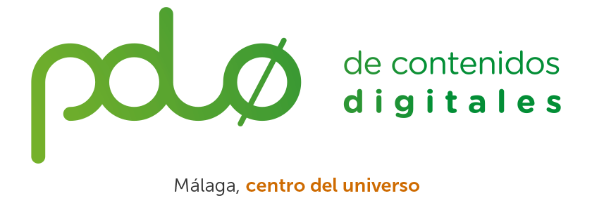

# Cuarto Meetup Angular Málaga

## Grupo de Meetup

[Grupo de Meetup "Angular Málaga"](https://www.meetup.com/es-ES/Angular-Malaga/).

## Evento patrocinado por Rindus

## Lugar y fecha

:round_pushpin: **Polo de contenidos digitales**. Avda. Sor Teresa Prat, 15
29003 Málaga - Sala de proyecciones

:date: Sábado 21 de julio de 2018

:clock2: Desde las 10:30h hasta las 18:00h

## Retransmisión en directo

Retransmisión del evento en streamming: (pendiente)

## Acceso y registro

El control de acceso al edificio será a partir de las 10:30h con vuestro **DNI** o **carnet de conducir**. Para hacerlo todo más rápido, inscríbete en el siguiente formulario. Rogamos puntualidad para empezar las charlas a las 11:00h.

Formulario de registro: https://goo.gl/forms/C2BHmGoC0TWlU1vj1

## Programa (provisional)

### :clock2: 10:30 - 11:00 :pencil: Acceso a las instalaciones

Acceso mediante **DNI** o **carnet de conducir**. Solo se permiten los usuarios registrados previamente.

### :clock2: 11:00 - 11:40 :speech_balloon: Material + Flex Layouts

 [Moisés Jiménez](https://github.com/mjimenezmartin)

Descripción de la charla...

[Presentación]()

[Ejemplos]()

### :clock2: 11:45 - 12:30 :speech_balloon: Testing en Angular

 [Carlos Caballero](https://github.com/Caballerog)

Descripción de la charla...

[Presentación]()

[Ejemplos]()

### :clock2: 12:45 - 13:30 :speech_balloon: Tests E2E con TestCafé

 [Jesus Rodriguez](https://github.com/Foxandxss)

¿Cansado de usar Webdriver + Selenium para tus pruebas de integración? ¿Pillas la baja cuando te piden testear algo?

En esta presentación, veremos esos problemas tan reales y una muy buena alternativa que nos devolverá la ilusión por el E2E.

[Presentación]()

[Ejemplos]()

### :clock2: 13:45 - 15:00 :pizza: Almuerzo.

La comida tendrá lugar en el office y corre a cargo de nuestro patrocinador.

### :clock2: 15:00 - 18:00 :computer: Mini-hackathon.

Mini-hackathon con retos y regalos :gift:

